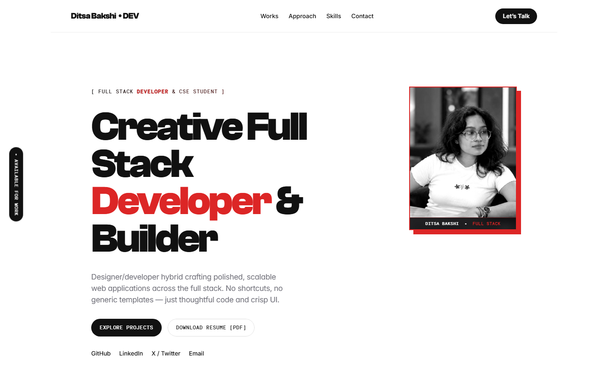
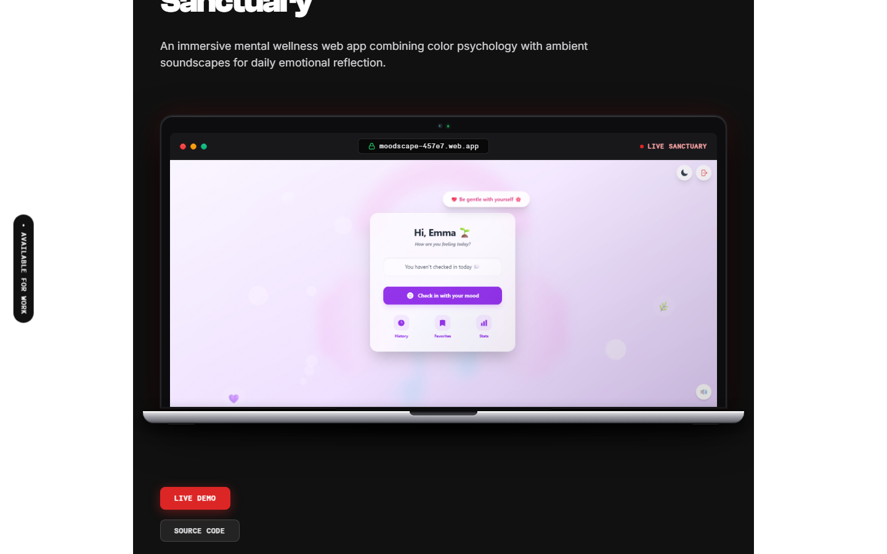

# 🌐 Ditsa Bakshi — Creative Full Stack Developer Portfolio

An editorial, high-performance portfolio website built with modern web standards, featuring bespoke typography, interactive 3D device mockups, fluid micro-interactions, and a curated project showcase.

🔗 **Live Website (GitHub Pages):**  
[https://aj69op.github.io/ditsa-portfolio/](https://aj69op.github.io/ditsa-portfolio/)

🚀 **Repository:**  
[https://github.com/aj69op/ditsa-portfolio](https://github.com/aj69op/ditsa-portfolio)

---

## 📸 Preview

<p align="center">
  
</p>

### 💻 Interactive 3D MacBook Pro Device Showcase
<p align="center">
  
</p>

---

## ✨ Highlights & Architecture

- **Cinematic Entry Reveal:** Seamless black curtain intro transition on first load that elegantly reveals the portfolio.
- **Editorial Typography & Swiss-Grid Design:** Custom typography pairing **Clash Grotesk** (display headings), **Necto Mono** (code tags & indices), and **Inter** (body copy).
- **Interactive 3D MacBook Pro Showcase:** Custom CSS/SVG retina mockup with space-gray chassis, dark Safari browser chrome, live SSL badge, and smooth perspective tilt with action overlays.
- **Micro-Interactions & Hover Dynamics:** Asymmetric bento cards with responsive highlight states, live project status tags, and smooth scroll anchors.
- **Zero Framework Bloat / Ultra Fast:** Pure static HTML5, CSS3, and ES6+ JavaScript engineered for maximum lighthouse scores and zero external framework lock-in.
- **Ready for Netlify & GitHub Pages:** Includes pre-configured `netlify.toml`, security `_headers`, routing `_redirects`, and optimized assets.

---

## 🛠️ Tech Stack

| Domain | Technologies |
| :--- | :--- |
| **Frontend Core** | HTML5, CSS3 Custom Properties, Modern JavaScript (ES6+) |
| **Typography** | Clash Grotesk, Necto Mono, Inter |
| **Design Style** | Editorial Swiss-grid, Dark Aesthetic, Interactive 3D Mockup |
| **Tooling & Build** | Python asset pipeline (`build_enhanced.py`), Playwright visual verification |
| **Deployment Targets** | Netlify (`publish = "framer_export"`), GitHub Pages |

---

## 🚀 Featured Projects

1. **[MoodScape](https://moodscape-457e7.web.app)** — Mental Wellness Sanctuary  
   *React • Firebase • Web Audio API*  
   Interactive mood tracking sanctuary combining color psychology with ambient soundscapes for daily emotional reflection.

2. **CashFlow** — Financial Tracking Platform  
   *React • Vite • State Management*  
   Streamlined income/expense analytics dashboard with real-time balance calculations.

3. **FashionHub** — E-Commerce Editorial UI  
   *HTML5 • CSS3 • JavaScript*  
   High-contrast minimalist apparel showcase with fluid product layouts.

4. **BookVerse** — Book Discovery Platform  
   *JavaScript • REST APIs • UI/UX*  
   Clean literature exploration web app with search and contextual categorization.

5. **Candy Crush, Maze Runner & SmartNotes**  
   *Interactive Games & Chrome Extension*  
   Grid puzzle mechanics, progressive maze solver algorithms, and contextual browser annotation tooling.

---

## 📁 Repository Structure

```text
├── index.html                 # Root portfolio application
├── style.css                  # Responsive design system & 3D laptop styles
├── script.js                  # Navigation, intro reveal & interactions
├── netlify.toml               # Netlify deployment configuration (targets framer_export)
├── images/                    # Project screenshots, icons & preview assets
├── fonts/                     # Webfonts (Clash Grotesk, Necto Mono, Inter)
├── assets/                    # Search indices and static assets
├── framer_export/             # Standalone production bundle ready for Netlify
│   ├── index.html             # Production-optimized single-page build
│   ├── build_enhanced.py      # Automated generator script
│   ├── netlify.toml           # Netlify settings for subfolder deploy
│   ├── _headers & _redirects  # Security headers & MIME configs
│   ├── images/                # Localized media assets
│   └── fonts/                 # Embedded webfonts
└── README.md                  # Project documentation
```

---

## 🌐 Deployment

### Netlify Deployment (Recommended)
This repository includes a [`netlify.toml`](netlify.toml) configured to publish `framer_export` automatically:
1. Connect this GitHub repository ([`aj69op/ditsa-portfolio`](https://github.com/aj69op/ditsa-portfolio)) to Netlify.
2. Netlify will automatically detect `netlify.toml` and set:
   - **Publish directory:** `framer_export`
3. Hit **Deploy Site** — all security headers, routes, and fonts will deploy instantly.

### GitHub Pages
1. Go to repository **Settings** → **Pages**.
2. Under **Build and deployment**, set source to `Deploy from a branch` → `main` → `/ (root)`.
3. The site is live at: [https://aj69op.github.io/ditsa-portfolio/](https://aj69op.github.io/ditsa-portfolio/)

---

## 📬 Contact & Profiles

- **GitHub:** [@aj69op](https://github.com/aj69op)
- **Portfolio Subject / Dev:** Ditsa Bakshi ([LinkedIn](https://www.linkedin.com/in/ditsa-bakshi-578468323/) · [X / Twitter](https://x.com/BakshiDitsa))
- **Email:** [bakshiditsa@gmail.com](mailto:bakshiditsa@gmail.com)

---

⭐ Star this repository if you find it helpful!
